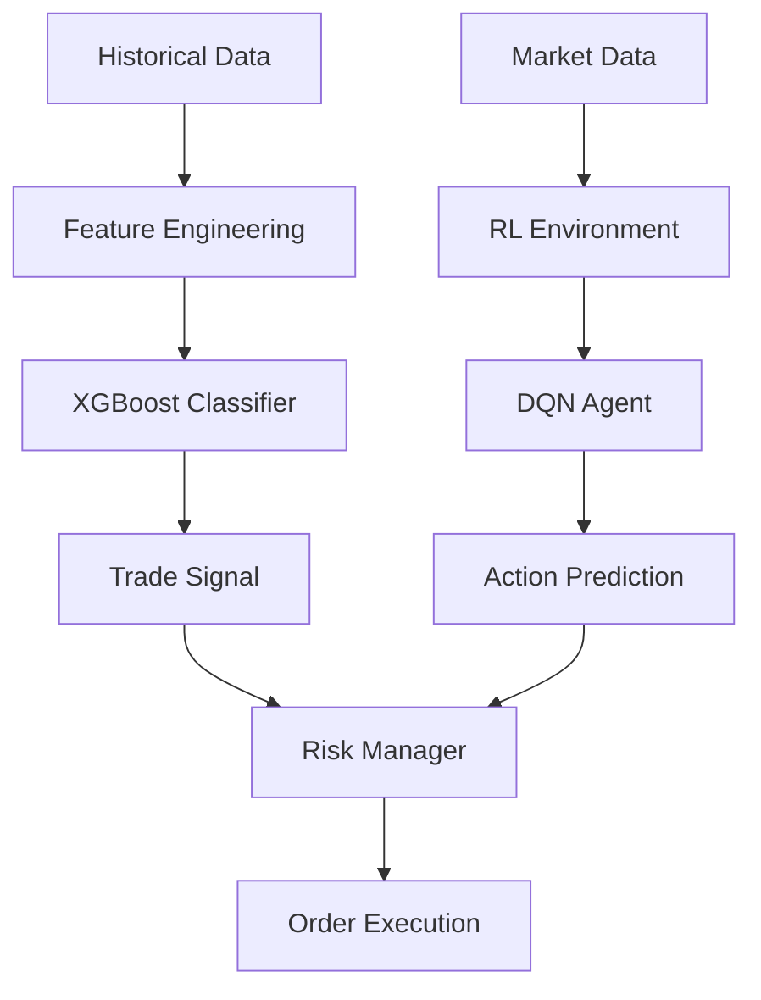

# 🌆 Arasaka Neural-Net Trading Matrix

<div align="center">


**🏙️ Welcome to Night City's premier AI-driven crypto trading daemon 🏙️**

*Jack into the Net and stack Eddies with cutting-edge Neural-Net technology*

</div>

---

## 🔮 **SYSTEM OVERVIEW**

The **Arasaka Neural-Net Trading Matrix** is a militech-grade cryptocurrency trading bot that operates locally on your rig. Powered by advanced **Machine Learning** (XGBoost) and **Reinforcement Learning** (DQN) algorithms, this cyber-enhanced daemon analyzes up to **15 years** of market data to dominate bull, bear, and altcoin markets.

### ⚡ **Core Features**

| Feature | Description | Status |
|---------|-------------|--------|
| 🧠 **Neural-Net Trading** | ML/RL models with GPU acceleration | ✅ ACTIVE |
| 🎯 **Dynamic Pair Selection** | Auto-selects trending pairs via volume analysis | ✅ ACTIVE |
| 💰 **Arbitrage Engine** | Cross-exchange profit opportunities | ✅ ACTIVE |
| 📊 **Sentiment Analysis** | Real-time social media & news sentiment | ✅ ACTIVE |
| 🛡️ **Risk Management** | Adaptive leverage, Kelly sizing, ATR stops | ✅ ACTIVE |
| 🎮 **Netrunner's Dashboard** | Cyberpunk-themed GUI interface | ✅ ACTIVE |
| ⚠️ **Kill Switch** | Emergency trading halt system | ✅ STANDBY |

---

## 🚀 **QUICK DEPLOYMENT**

### **Option 1: Source Installation** *(Recommended for Netrunners)*

```bash
# Clone the mainframe
git clone https://github.com/your-username/arasaka-neural-net-matrix.git
cd arasaka-neural-net-matrix

# Initialize virtual environment
python -m venv venv
source venv/bin/activate  # Linux/Mac
# venv\Scripts\activate   # Windows

# Install dependencies
pip install -r requirements.txt

# Configure credentials
cp .env.example .env
# Edit .env with your API keys
```

### **Option 2: Pre-Built Executable** *(For Corporate Users)*

1. Download `ArasakaTradingMatrix.exe` from [Releases](../../releases)
2. Run installer with admin privileges
3. Launch via desktop shortcut
4. Configure API keys in settings

---

## ⚙️ **SYSTEM CONFIGURATION**

### **🔑 Required Credentials**

Create your `.env` file with the following:

```env
# Exchange API Credentials
BINANCE_API_KEY=your_binance_api_key
BINANCE_API_SECRET=your_binance_secret

# Optional Enhancement APIs
CRYPTOPANIC_API_KEY=your_sentiment_key
GLASSNODE_API_KEY=your_onchain_key
TRADINGVIEW_API_KEY=your_social_key

# System Configuration
TESTNET=true  # Start with testnet for safety
LOG_LEVEL=INFO
DATABASE_URL=sqlite:///local_trading.db
```

### **📊 Initialize Database**

```bash
python scripts/setup_database.py
```

### **🚀 Launch Sequence**

```bash
# Start API daemon
uvicorn api.app:app --host 127.0.0.1 --port 8000

# Launch Netrunner's Dashboard (in new terminal)
python gui/main.py
```

---

## 🎮 **NETRUNNER'S DASHBOARD**

<div align="center">

### **Main Interface**
*Experience the future of trading with our neon-lit cyberpunk GUI*

</div>

### **🎯 Trading Controls**

- **🔍 Scan Optimal Pair**: AI-powered pair selection with volume spike detection
- **💎 Stack Eddies**: Execute buy/sell orders with dynamic leverage
- **⚖️ Risk Profiles**: Choose from Conservative, Moderate, or Aggressive protocols
- **🧪 Testnet Toggle**: Switch between demo and live trading modes
- **🧠 Train Neural-Net**: Retrain AI models with latest market data

### **📈 Analytics Suite**

- **Portfolio Tracker**: Real-time P&L and position monitoring
- **Backtest Engine**: Historical strategy performance analysis
- **Sentiment Monitor**: Market mood from social media and news
- **Risk Dashboard**: Real-time risk metrics and exposure analysis

### **⚠️ Emergency Protocols**

- **🚨 Kill Switch**: Immediate trading halt and position liquidation
- **🔒 Security Lock**: Tamper detection and data protection
- **💾 Auto Backup**: Scheduled database backups

---

## 🧠 **AI ARCHITECTURE**

### **Machine Learning Pipeline**



### **🎯 Features Analyzed**

- **Technical Indicators**: SMA, RSI, MACD, Bollinger Bands
- **Market Sentiment**: Social media analysis, news sentiment
- **On-Chain Metrics**: Whale movements, exchange flows
- **Volatility Patterns**: ATR, historical volatility
- **Seasonality**: Time-based market patterns

---

## 📊 **SUPPORTED EXCHANGES**

| Exchange | Status | Features |
|----------|--------|----------|
| 🟡 **Binance** | ✅ Full Support | Spot, Futures, Testnet |
| 🔵 **Kraken** | ✅ Spot Trading | API Integration |
| 🟢 **Coinbase** | ✅ Spot Trading | Pro API |

---

## 🛡️ **RISK MANAGEMENT**

### **Adaptive Risk Protocols**

- **Dynamic Leverage**: 1x-3x based on market conditions and confidence
- **Kelly Sizing**: Optimal position sizing based on win probability
- **ATR Stop-Loss**: Volatility-adjusted stop losses
- **Flash Crash Protection**: Rapid liquidation during market crashes
- **Portfolio Hedging**: Cross-asset correlation hedging

### **Risk Profiles**

| Profile | Max Position | Daily Loss Limit | Leverage |
|---------|--------------|------------------|----------|
| **Conservative** | 0.5% | 2% | 1x |
| **Moderate** | 1% | 5% | 2x |
| **Aggressive** | 2% | 10% | 3x |

---

## 📈 **PERFORMANCE ANALYTICS**

### **Key Metrics Tracked**

- **Sharpe Ratio**: Risk-adjusted returns
- **Maximum Drawdown**: Worst peak-to-trough decline
- **Win Rate**: Percentage of profitable trades
- **Profit Factor**: Ratio of gross profit to gross loss
- **Calmar Ratio**: Annual return vs max drawdown

### **Strategy Options**

- **🚀 Breakout**: Momentum-based trend following
- **🔄 Mean Reversion**: RSI-based contrarian strategy
- **📊 Multi-Timeframe**: Combined 1h, 4h, 1d analysis

---

## ⚡ **SYSTEM REQUIREMENTS**

### **Minimum Specs**
- **CPU**: Dual-core 2.0 GHz
- **RAM**: 8 GB
- **Storage**: 10 GB free space
- **OS**: Windows 10/11, macOS 10.15+, Ubuntu 20.04+
- **Python**: 3.9-3.11
- **Network**: 10 Mbps broadband

### **Recommended Specs**
- **CPU**: Quad-core 3.0 GHz+
- **RAM**: 16 GB
- **Storage**: 50 GB SSD
- **GPU**: NVIDIA GTX 1060+ (CUDA 11.8)
- **Network**: 50 Mbps fiber

---

## 🔧 **ADVANCED CONFIGURATION**

### **📊 Historical Data Import**

```bash
# Download historical data (see docs/historical_data_guide.md)
mkdir data/historical

# Import data
python scripts/import_historical_data.py
```

### **🎮 GPU Acceleration**

```bash
# Install CUDA support
pip install tensorflow-gpu

# Verify GPU detection
python -c "import tensorflow as tf; print(tf.config.list_physical_devices('GPU'))"
```

---

## 🛠️ **TROUBLESHOOTING**

### **Common Issues**

| Problem | Solution |
|---------|----------|
| ❌ API Connection Failed | Check API keys and network |
| ❌ Database Lock Error | Restart application |
| ❌ GPU Not Detected | Install CUDA 11.8 + cuDNN |
| ❌ Import Error | Run `pip install -r requirements.txt` |

### **📋 Debug Checklist**

1. ✅ Verify API credentials in `.env`
2. ✅ Check `trading.log` for error messages
3. ✅ Ensure database is initialized
4. ✅ Confirm Python version compatibility
5. ✅ Test network connectivity

---

## 📚 **DOCUMENTATION**

- **📖 [Installation Guide](docs/installation.md)**
- **⚙️ [Configuration Reference](docs/configuration.md)**
- **📊 [Data Import Guide](docs/historical_data_guide.md)**
- **🧠 [AI Model Training](docs/model_training.md)**
- **🛡️ [Security Protocols](docs/security.md)**

---

## 🚨 **DISCLAIMER**

> **⚠️ WARNING: FINANCIAL RISK**
> 
> This software is for educational and research purposes. Cryptocurrency trading involves substantial risk of loss. Always:
> - Start with testnet mode
> - Never invest more than you can afford to lose
> - Understand the risks before live trading
> - Comply with local regulations

---

## 📄 **LICENSE**

```
MIT License - Feel free to jack this code and make it your own, Choom!
```

---

## 🤝 **CONTRIBUTING**

Want to enhance the Matrix? We welcome contributions from fellow Netrunners!

1. **Fork** the repository
2. **Create** a feature branch
3. **Commit** your changes
4. **Push** to the branch
5. **Submit** a pull request

---

## 📞 **SUPPORT**

- **🐛 Bug Reports**: [GitHub Issues](../../issues)
- **💡 Feature Requests**: [GitHub Discussions](../../discussions)
- **📧 Contact**: `netrunner@arasaka-matrix.net`

---

<div align="center">

**🌆 Built with ❤️ in Night City 🌆**

*Stack Eddies, Stay Jacked, Choom!*

[](../../stargazers)
[](../../network/members)

</div>